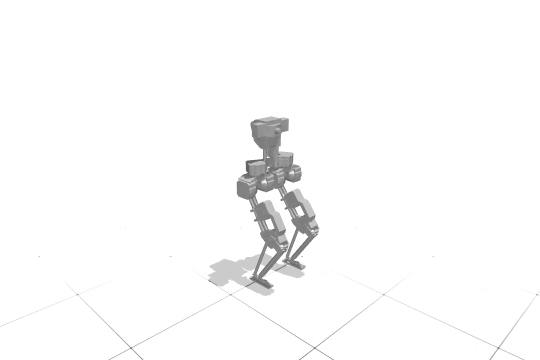

# NaviGait
<p align="center">
    
</p>
NaviGait combines a library of HZD-generated gaits with deep reinforcement
learning to achieve robust and dynamic bipedal walking. NaviGait generates new
motions by (1) extracting motions from the gait library by applying a resiudal velocity to the user's commanded
velocity (2) blending the newly selected reference motion with the current one and (3) adding joint-level residuals to the reference motion to correct the motion for robust stability.

# Required conda enviornment
An `environment.yml` file has been created that contains the packages necessary
for running NaviGait. However, it is possible that NVIDIA drivers might need
to be updated. To create the conda environment, run
```bash
conda env create -f environment.yml
```
Then, to activate, run
```bash
conda activate navigait
```

# Simulate Example (Trained) Policy
To simulate an example policy, run
```bash
python3 -m eval.rollout_policy icra-policies/navigait/config.yaml
```
Similarly, our baselines Imitation RL and Canonical RL can also be run.

# Train NaviGait
To train NaviGait, we use configuration files stored in the `config` directory.
Edit `learning/training.sh` to reference the correct conda environment (likely just `navigait` if you used our .yml file) and run
```bash
./learning/train.sh config/bruce-navigait.yaml
```
This will start a `tmux` session that you can exit out of. Note that a list of
`tmux` shortcuts can be found [here](https://tmuxcheatsheet.com/). Training
takes around 22-23 minutes on an RTX A4000 GPU.

# Citation
If you use NaviGait in your academic work, please use the following citation 

```bibtex
@inproceedings{janwani2025navigait,
  title={NaviGait: Navigating Dynamically Feasible Gait Libraries using Deep Reinforcement Learning},
  author={Janwani, Neil C and Madabushi, Varun and Tucker, Maegan},
  booktitle={2026 IEEE International Conference on Robotics and Automation (ICRA)},
  year={2026},
  organization={IEEE},
  url={https://dynamicmobility.github.io/navigait}
}
```