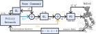

## Approach: [NaviGait]{.smallcaps} {.nav-approach}
[NaviGait]{.smallcaps} uses RL to 'fill the gaps' of gait libraries.

1. Synthesize underlying gait library $\mathcal{G}$ via trajectory optimization.
2. Use RL to transition between and correct motion plans in $\mathcal{G}$.

{style="display: block; margin: 0 auto; max-width: 100%;"}

:::: {.columns}

::: {.column width="50%"}
[Replaces *transition control* by retrieving and interpolating $\mathcal{X}_i \in \mathcal{G}$.]{style="color: rgb(0, 114, 178);"}
:::

::: {.column width="50%"}
[Replaces *regulators* by providing joint-level corrections to gait $\mathcal{X}_i$.]{style="color: rgb(230, 159, 0);"}
:::

::::