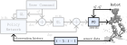
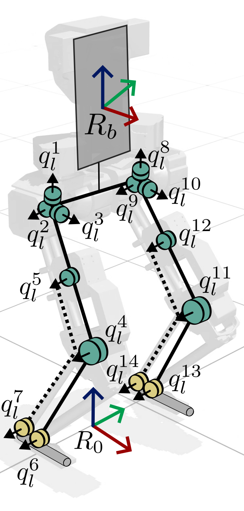
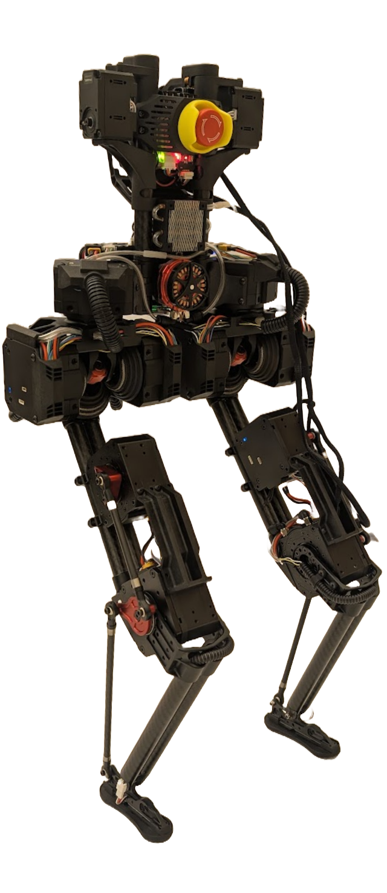

## BRUCE Humanoid Robot {.nav-approach}

{.absolute top=-30 right=-130 width="35%" style="z-index: 10;"}

:::: {.columns}

::: {.column width="60%"}
We utilize the Westwood Robotics BRUCE Humanoid Robot

Desired joint $\hat{q}_d$ are tracked via low-level PD-control.

We improve simulation fidelity by including 

1. Differential drive mechanism (hip) 
2. 4-bar linkage mechanism (knee-ankle)
:::

::: {.column width="21%"}
{style="max-width: 100%;"}
:::

::: {.column width="19%"}
{style="max-width: 100%;"}
:::

::::
