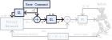
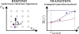

## Gait Libraries: Blending and Interpolating {.nav-approach}
<!-- 1. How are gaits transitioned between? -->

<!-- Six phase videos stacked on top of each other. Each is wrapped in a
     reveal.js `.fragment` div so arrow-right reveals it and
     `startEmbeddedMedia` (which does `queryAll(fragmentEl, 'video')`)
     autoplays the inner video. Each phase's first frame matches the
     previous phase's last frame, so transitions look seamless. -->

{.absolute top=-30 right=-60 width="30%" style="z-index: 10;"}

<video src="../media/BezierPhaseA.mp4" data-autoplay muted playsinline style="max-width: 100%;"></video>

<video src="../media/BezierPhaseB.mp4" data-autoplay muted playsinline style="max-width: 100%;"></video>

<video src="../media/BezierPhaseC.mp4" data-autoplay muted playsinline style="max-width: 100%;"></video>

<video src="../media/BezierPhaseD.mp4" data-autoplay muted playsinline style="max-width: 100%;"></video>

<video src="../media/BezierPhaseE.mp4" data-autoplay muted playsinline style="max-width: 100%;"></video>

<!-- 
<video src="../media/BezierPhaseF.mp4" data-autoplay muted playsinline style="max-width: 100%;"></video>
 -->

{style="margin-top: -5em; position: relative; z-index: 20;"}
