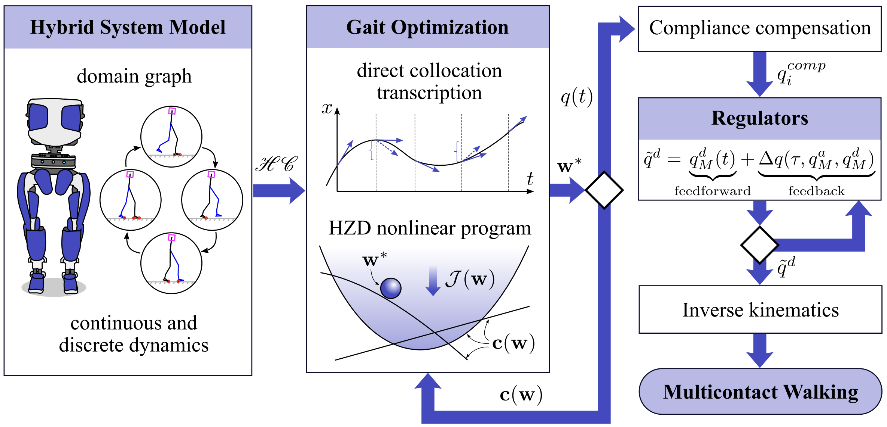

## Gait Libraries: Interpolating Between Motion Plans {.nav-intro}

**Possible Approach**: transition between different motion plans $\{\mathcal{X}\}$ in a gait library $\mathcal{G}$ to stabilize the robot.

:::: {.columns}

::: {.column width="50%"}
1. Physically meaningful motion specification for all $\mathcal{X}$.
2. Tune control laws to transition to from current $\mathcal{X}_i$ to new gait $\mathcal{X}_j$.

:::

::: {.column width="50%"}

However, this can be fragile and requires heuristics to balance.

<video src="../media/Durus.mp4" autoplay loop muted style="display: block; margin: 0 auto; max-width: 60%;"></video>
:::

::::

