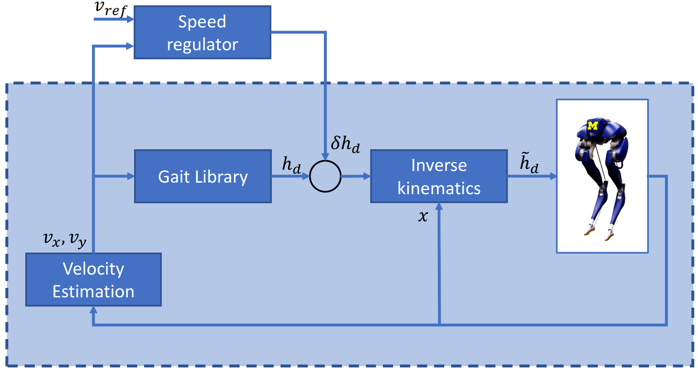

## Gait Libraries: Interpolating Between Motion Plans {.nav-intro}

**Possible Approach**: transition between different motion plans $\{\mathcal{X_i}\}$ in a gait library $\mathcal{G}$ to stabilize the robot.

:::: {.columns}

::: {.column width="50%"}
1. Physically meaningful motion specification for each $\mathcal{X}_i$.
2. Tune control laws to transition to from current $\mathcal{X}_j$ to new gait $\mathcal{X}_k$.

:::

::: {.column width="50%"}

While this approach can work well, it requires significant heuristics and tuning.

<video src="../media/cassie_gl.mp4" autoplay loop muted style="display: block; margin: 1.7em auto 0; max-width: 100%;"></video>
:::

::::

