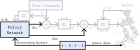

## Residual RL: Adapting to Disturbance {.nav-approach}

{.absolute top=-30 right=-60 width="30%" style="z-index: 10;"}

We utilize RL to concurrently achieve two objectives:

:::: {.columns}

::: {.column width="30%"}
1. *Transition between* $\mathcal{X}_i \in \mathcal{G}$ via $\Delta v$.
2. *Correct* the current $\mathcal{X}_i$ via $\Delta q$.
:::

::: {.column width="45%"}
<video src="../media/NaviGait_hero_push_cropped.mp4" data-autoplay loop muted playsinline style="max-width: 100%;"></video>
:::

::: {.column width="25%"}
<video src="../media/hero_push_vr.mp4" data-autoplay loop muted playsinline style="max-width: 100%;"></video>
:::

::::

:::: {.columns}

::: {.column width="60%"}

Reward Function

\begin{align}
    R_{\textrm{NaviGait}}^t(s, a) =~&R_{\text{Gait}}^t + R_{\text{Base Cartesian}}^t + \\
    &R_{\text{Base Orientation}}^t + R_{\text{torque}} + \\
    &R_{\Delta v \text{ size}}^t + R_{\Delta v \text{ rate}} + R_{\Delta q \text{ rate}}. \notag
\end{align}

:::

::: {.column width="40%"}

Observation (histories)

1. Sensors: IMU + encoders.
2. Reference gait selection.
3. Previous $\pi_\theta$ outputs.
:::

::::