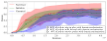
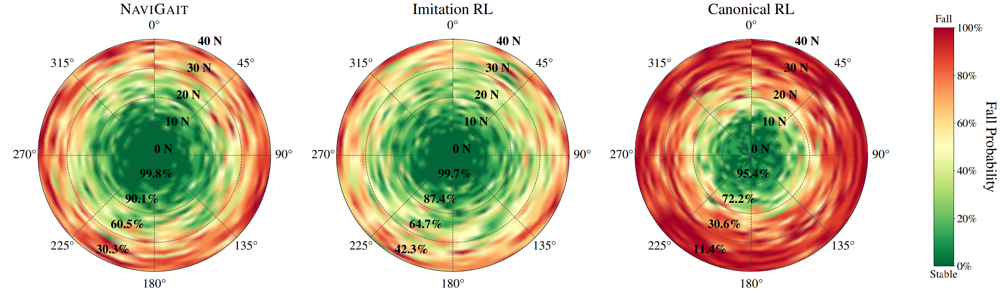

## Results: Training and Basic Performance {.nav-results}

:::: {.columns}

::: {.column width="65%"}
[NaviGait]{.smallcaps} learns core walking skills, and emergent turning behavior + works on hardware!

We also compare [NaviGait]{.smallcaps} against two baselines: **Canonical RL** and **Imitation RL**.
<!-- We also showcase [NaviGait]{.smallcaps} working on hardware under a perturbation. -->
:::

::: {.column width="22.3%"}
<video src="../media/commanded_NaviGait.mp4" data-autoplay loop muted playsinline style="max-width: 100%;"></video>
:::

::: {.column width="12.7%"}
<video src="../media/hardware_trimmed%20(1).mp4" data-autoplay loop muted playsinline style="max-width: 100%;"></video>
:::

::::

::: {.fragment .fade-in-then-out fragment-index=1 style="position: absolute; top: 0; left: 0; width: 100%;"}
[NaviGait]{.smallcaps} learns locomotion skills faster than both baseline algorithms.

{fig-align="center" width="65%" style="width: 100%; max-width: 100%;"}
:::

::: {.fragment fragment-index=2 style="position: absolute; top: 0; left: 0; width: 100%;"}
[NaviGait]{.smallcaps} learns similar robustness to **Imitation RL**.

{fig-align="center" width="85%" style="width: 100%; max-width: 100%;"}
:::

